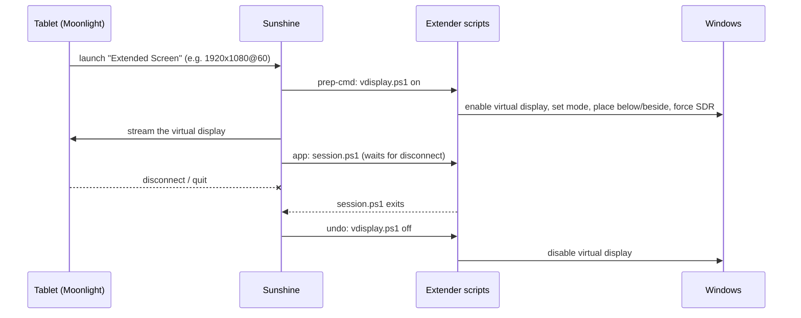

# Moonlight Desktop Extender

**Use an old Android tablet (or any Moonlight device) as a real second monitor for your Windows PC: an *extended* desktop instead of a mirror, at low latency over USB or Wi-Fi.**


[Sunshine](https://github.com/LizardByte/Sunshine) + [Moonlight](https://moonlight-stream.org/) stream smoothly even to very old hardware, because the tablet's own video decoder does all the work. Out of the box, though, they *mirror* your main monitor. If that monitor runs HDR, the SDR tablet also gets washed-out colours.

This project adds an **"Extended Screen"** app to Sunshine. Picking it on the tablet creates a virtual monitor at the tablet's resolution, in SDR, placed next to your main screen. Disconnecting removes the virtual monitor again. When you're not using the tablet, nothing is left running: no phantom display for your mouse or windows to get lost on.

## Features

- **Real extended desktop**, not a clone. Drag windows onto the tablet.
- **Exists only while connected.** The virtual display is created on connect and removed on disconnect, whether you press *Quit* or just back out.
- **Matches the client.** Uses whatever resolution and refresh rate Moonlight asks for, and adds new modes to the driver automatically.
- **SDR, so no HDR colour distortion.** Your main monitor keeps its HDR.
- **Leaves your sound alone.** Audio stays on the PC (configurable).
- **One-click on/off.** A desktop shortcut starts or stops Sunshine. Sunshine no longer runs at boot.
- **Mirror still available.** Sunshine's normal *Desktop* app keeps mirroring your main monitor.
- **Works with old Moonlight versions.** Nothing changes on the client side, so a tablet that can't update its apps still works.

## How it works



- The virtual monitor comes from the [Virtual Display Driver](https://github.com/VirtualDrivers/Virtual-Display-Driver) (an IddCx driver). It stays installed but **disabled** while you aren't streaming.
- Sunshine's `output_name` points at the virtual display. While that display is off, Sunshine falls back to the primary monitor, which is why the normal *Desktop* app still mirrors.
- Sunshine configures displays *before* it runs prep commands, so its own resolution matching can't see a display that only appears in a prep command. `vdisplay.ps1` therefore sets the mode itself, from `SUNSHINE_CLIENT_WIDTH`, `SUNSHINE_CLIENT_HEIGHT` and `SUNSHINE_CLIENT_FPS`.
- Sunshine only runs undo commands when the app stops, and a desktop-style app never stops by itself. `session.ps1` acts as the app and exits when Sunshine logs `CLIENT DISCONNECTED`. That way just backing out of Moonlight also removes the display.

## Requirements

- Windows 10 or 11, x64
- A GPU with a hardware encoder that Sunshine supports (NVIDIA, AMD or Intel)
- [winget](https://learn.microsoft.com/windows/package-manager/winget/), which is built into Windows 11. The installer uses it to fetch Sunshine and the Virtual Display Driver if they're missing.
- Moonlight on the tablet or other client device

## Install

1. Download the repository (**Code → Download ZIP**, or `git clone`) and put it somewhere permanent, for example `C:\Tools\moonlight-desktop-extender`. Sunshine runs the scripts from that folder, so if you move it, run the installer again.
2. Double-click **`install.cmd`** and approve the administrator prompt.

That's it. The installer:

| Step | What happens |
|---|---|
| Prerequisites | Installs **Sunshine** and the **Virtual Display Driver** with winget if they're missing |
| Driver | Installs the virtual display device, and disables it again at the end |
| Sunshine config | Sets `output_name` to the virtual display and `stream_audio = disabled` |
| Sunshine app | Adds **Extended Screen** (with its own icon) to Sunshine's app list |
| Service | Sets the Sunshine service to **Manual** start |
| Shortcuts | Creates **Extended Screen** on the Desktop and in the Start menu |
| Backups | The original `sunshine.conf` and `apps.json` are kept as `*.pre-extender` |

The installer is safe to re-run at any time: after a Sunshine update, to change options, or after moving the folder.

**Options** (pass them to `install.cmd` from a terminal, or change `config.json` and re-run):

```bat
install.cmd -Position right        :: below (default) | above | left | right
install.cmd -Align start           :: center (default) | start | end
install.cmd -StreamAudio           :: also send sound to the tablet
```

### First-time Sunshine setup

If Sunshine is new on this PC:

1. Click the **Extended Screen** shortcut to start Sunshine.
2. Open <https://localhost:47990> and create a Sunshine username and password.
3. In Moonlight on the tablet, add the PC. When it shows a PIN, enter it in Sunshine's web UI under **PIN**.

## Connecting the tablet over USB (recommended)

USB gives the lowest latency and also keeps the tablet charged.

1. Plug the tablet into the PC.
2. On the tablet, go to **Settings → Network → Tethering** and turn on **USB tethering**. Windows gets a new network adapter ("Remote NDIS based Internet Sharing Device").
3. In Moonlight, the PC should appear by itself. If it doesn't, tap **+** and enter the PC's IP address on that adapter (usually `192.168.42.x`; find it with `ipconfig`).

USB tethering switches off whenever the cable is unplugged, so turn it back on after replugging. Wi-Fi works too, with a bit more latency.

> **spacedesk users:** spacedesk's Windows service switches Android devices into its own USB mode (*Android Open Accessory*), which blocks USB tethering. Stop `spacedeskService` (or set it to Manual) and replug the tablet.

## Daily use

1. Click **Extended Screen** on the desktop. Sunshine starts.
2. On the tablet, open Moonlight and pick **Extended Screen**.
3. When you're done, back out of the stream. The virtual display disappears.
4. Click **Extended Screen** again to stop Sunshine.

Tip: long-press the **Desktop** tile in Moonlight and hide it if you never want the mirror.

## Configuration

`config.json`, in the project folder:

| Key | Default | Meaning |
|---|---|---|
| `position` | `below` | Where the tablet screen sits: `below`, `above`, `left`, `right` |
| `align` | `center` | Alignment along that edge: `center`, `start`, `end` |
| `forceSdr` | `true` | Turn HDR off on the virtual display if Windows enables it |
| `streamAudio` | `false` | Send PC audio to the tablet (re-run the installer after changing) |
| `fallbackWidth` / `fallbackHeight` / `fallbackFps` | `1920` / `1080` / `60` | Mode used when Sunshine doesn't pass the client's request |
| `sunshineDir` | *(auto)* | Sunshine install folder, if auto-detection fails |
| `displayWaitSeconds` | `15` | How long to wait for the virtual display to appear |

The picture's sharpness is set **in Moonlight** on the tablet (**Settings → Resolution**). The virtual display follows that setting.

## Troubleshooting

All scripts log to `logs\extender.log`. The installer also writes `logs\install.log`. Sunshine's own log is at `C:\Program Files\Sunshine\config\sunshine.log`.

| Symptom | Fix |
|---|---|
| Moonlight says *"Failed to start Extended Screen" (404)* after re-installing | Sunshine derives app IDs from the name and the icon, so Moonlight still has the old ID cached. Back out to the PC list and open the PC again to reload the app list. |
| The tablet shows a copy of the main screen | You picked **Desktop**. Pick **Extended Screen**. |
| PC doesn't see the tablet over USB | Check that USB tethering is on (it resets on replug) and that spacedesk isn't running (see above). |
| Picture is soft | Moonlight is requesting a low resolution (often 720p). Raise it in Moonlight's settings. |
| Virtual display stays after a crash | Click the shortcut off and on again, or run `scripts\vdisplay.ps1 off` as administrator. |
| Check the current state | `powershell -ExecutionPolicy Bypass -File scripts\vdisplay.ps1 status` |

## Uninstall

Double-click **`uninstall.cmd`**. It removes the Sunshine app and settings, the shortcuts and the Manual start type, and disables the virtual display. To also remove the Virtual Display Driver:

```bat
uninstall.cmd -RemoveDriver
```

Sunshine and Moonlight themselves are left installed.

## Project layout

```
install.cmd / uninstall.cmd   double-click entry points
config.json                   options
assets/extended-screen.png    Moonlight tile for the app
scripts/
  install.ps1                 setup (idempotent)
  uninstall.ps1               teardown
  vdisplay.ps1                on / off / status of the virtual display (Sunshine prep-cmd)
  session.ps1                 the app process; exits on client disconnect
  toggle.ps1                  desktop shortcut: start/stop Sunshine
  Common.ps1                  shared helpers
  Display.cs                  Win32 display mode / position / HDR interop
```

## Credits

- [Sunshine](https://github.com/LizardByte/Sunshine) by LizardByte
- [Moonlight](https://github.com/moonlight-stream)
- [Virtual Display Driver](https://github.com/VirtualDrivers/Virtual-Display-Driver) by VirtualDrivers / MikeTheTech

This project only automates and configures them. It isn't affiliated with any of them.

## License

[MIT](LICENSE)
